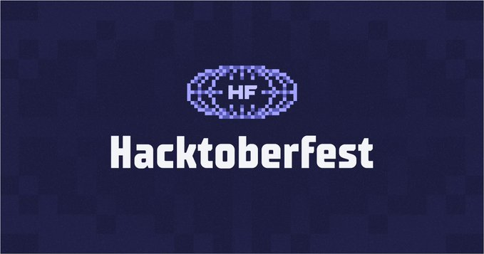

<p align="center">
  
</p>

# 🚀 Data Structures and Algorithms (DSA) – Hacktoberfest 2025

Welcome to the **Data Structures and Algorithms** open-source repository!  
This repo is created to help **beginners** and **intermediate programmers** practice and contribute their DSA problem solutions in **any programming language**.

---

## 🎯 Objective
The goal of this repository is to encourage you to:
- Write DSA solutions in your favorite programming language
- Learn Git & GitHub workflow (Fork → Commit → Pull Request)
- Contribute to **Hacktoberfest 2025**

---


### 💖 Hacktoberfest 2025

<p align="center">
  
  
  
</p>

This repository is participating in Hacktoberfest 2025! We welcome and encourage new contributors to help us improve this project.


---

## 🧩 How to Contribute

1. **Fork this repository**
2. **Clone your fork**:
   ```bash
   git clone https://github.com/<your-username>/data-structure-and-algorithm.git

***
